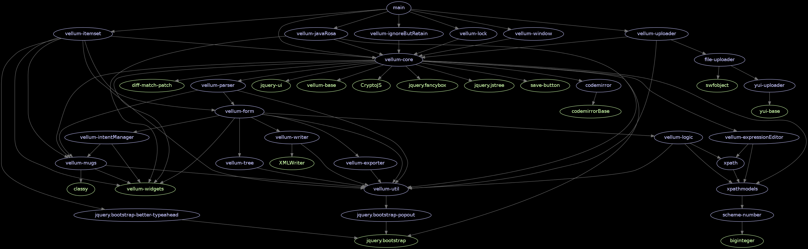

Vellum
======

Vellum is a JavaRosa [XForm](http://en.wikipedia.org/wiki/XForms) designer used
in [CommCare HQ](http://github.com/dimagi/commcare-hq).


Image courtesy of the [ReMIND
project](https://www.commcarehq.org/exchange/325775003aa58cfcefbc75cfdf132e4d/info/).

Usage
-----

Here's how to load everything asynchronously.  Instructions for built bundles
forthcoming.

Install dependencies:
```
$ npm install -g bower requirejs less csso
$ npm install
```

```html
<link rel="stylesheet" href="path/to/bootstrap.css"></link>

<!-- If these global dependencies are already present, then the existing
     instances will be used.  Otherwise, included versions will be loaded. -->
<script src="underscore.js"></script>
<script src="jquery.js"></script>
<script src="jquery-ui.js"></script>
<script src="bootstrap.js"></script>

<script src="bower_components/requirejs/require.js"></script>
<script>
    require.config({
        packages: [
            { 
                name: 'jquery.vellum',
                location: '/path/to/vellum-repo',
                main: 'main.js'
            }
        ]
    });

    // load paths config for dependencies of vellum, including jquery
    require(["jquery.vellum/require-config"], function () {
        require(["jquery", "jquery.vellum"], function ($) {
            $("#some_div").vellum({
                // OPTIONS
                // todo
            });
        });
    });
</script>
```

Contributing
------------

Make Pull Requests to the develop branch.

Follow the [Airbnb JavaScript Style Guide](https://github.com/airbnb/javascript).

Run tests in a browser:
```
$ python -m SimpleHTTPServer
$ chromium-browser http://localhost:8000
```

Run tests headlessly (currently broken):
```
$ npm install -g phantomjs
$ npm test
```

### Testing on Heroku

This repo can be deployed to Heroku using
[heroku-buildpack-vellum](http://github.com/mwhite/heroku-buildpack-vellum),
which is just a fork of
[heroku-buildpack-static](https://github.com/pearkes/heroku-buildpack-static)
with the build script from the standard Node.js buildpack added in order to
install dependencies.

Until [prune.io](http://prune.io/) is available, we use
Rainforest's [fourchette](https://github.com/jipiboily/fourchette) along with a
[slightly modified version](https://github.com/mwhite/fourchette-vellum) of
their example fourchette app in order to create an isolated test environment for
each Pull Request on Heroku.

The latest master is also deployed to
[vellum-master.herokuapp.com](http://vellum-master.herokuapp.com) using
[drone.io](http://drone.io).  See
[here](https://drone.io/github.com/mwhite/Vellum) for a list of builds.



Dependency graph, minus Underscore, jQuery, and util
